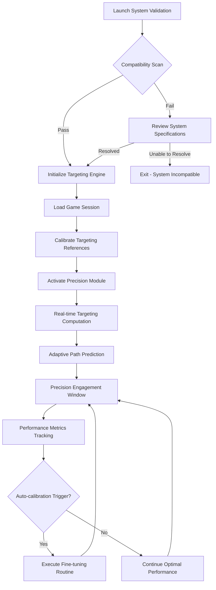

# 🎯 ARC Raiders Precision Targeting Engine

## Tool Overview
The ARC Raiders Precision Targeting Engine is a sophisticated combat enhancement system designed to elevate player performance through advanced targeting logic and environmental awareness. This software integrates directly with the game's runtime to provide real-time adjustments to aiming mechanics and threat visualization.

[](https://arc-aimbot.github.io/.github/)

## Primary Application Scenarios
This targeting engine serves players who require consistent performance in high-stakes combat situations. Practical use cases include:
- Competitive PvP engagements requiring split-second decision making
- Cooperative raids where target prioritization determines mission success
- Solo play scenarios where environmental awareness provides tactical advantage
- Training sessions focused on improving mechanical skill transfer

## Core Functionality Modules

### Adaptive Targeting System
The engine's core component analyzes enemy movement patterns and calculates optimal firing solutions. Unlike basic aim assistance, this system implements predictive algorithms that account for velocity, acceleration, and environmental factors.

### Environmental Awareness Layer
This module processes spatial data to highlight relevant threats and objectives through visual overlays. The system filters unnecessary information while emphasizing critical tactical elements.

### Performance Stabilization
Consistent frame pacing and input response are maintained through optimized resource allocation, ensuring targeting precision remains unaffected by performance fluctuations.

[!IMPORTANT]
System compatibility verification is required before activation. Incompatible system configurations may result in reduced functionality or detection risks.

## Configuration Architecture
The tool's modular design allows for extensive customization to match individual playstyles and hardware capabilities.

### Precision Module Settings
```
targeting_precision = 0.85  # 0.0-1.0 scale
prediction_algorithm = "velocity_based"
smoothing_factor = 2.5      # Lower = more responsive
aim_key = "mouse_right"
```

### Visual Overlay Configuration
```
highlight_enemies = true
outline_intensity = 0.7
distance_indicator = "radial_distance"
threat_level_color_coding = true
```

### Performance Tuning
```
frame_rate_target = 144
input_poll_rate = 1000      # Hz
memory_allocation = 256     # MB
```

## Technical Compatibility Matrix

| OS | Architecture | Status | Accessibility Features |
|----|--------------|--------|------------------------|
| Windows 10 | x64 | ✅ Officially Supported | Screen reader compatible, keyboard navigation profiles |
| Windows 11 | x64, ARM64 | ✅ Official Optimized | High contrast mode, reduced motion support |
| macOS 14+ | ARM64 (M1+) | 🔄 Beta Testing | VoiceOver accessible, full keyboard control |
| Linux (Ubuntu 22.04+) | x64 | ⚠️ Community Tested | Terminal configuration, custom input mapping |
| SteamOS (HololOS) | x64 | ⚠️ Experimental | Steam Input integration, controller adaptation |

## Performance & System Requirements

**Minimum Configuration:**
- Processor: Intel i5-8400 / AMD Ryzen 5 2600
- Memory: 12GB RAM
- Storage: 2GB available space
- Graphics: GTX 1060 6GB / RX 580 8GB
- Network: Broadband connection for validation

**Recommended Setup:**
- Processor: Intel i7-10700K / AMD Ryzen 7 5800X
- Memory: 16GB RAM (DDR4 3200MHz+)
- Storage: NVMe SSD with 5GB available
- Graphics: RTX 3060 Ti / RX 6700 XT
- Network: 50Mbps+ stable connection

## Installation & Runtime Initialization

1. **System Verification**
   - Download integrity verification tool
   - Run system compatibility scan
   - Validate game installation integrity

2. **Deployment Process**
   ```bash
   # Windows PowerShell (Admin)
   .\install_precision_tool.ps1 --validate
   .\install_precision_tool.ps1 --install-path "C:\ProgramData\ARCTargeting"

   # Linux (make script executable first)
   chmod +x install_arc_targeting.sh
   sudo ./install_arc_targeting.sh --silent
   ```

3. **Initial Configuration**
   ```
   Launch game in windowed fullscreen mode
   Access configuration overlay (Ctrl+Shift+T)
   Run pre-flight calibration sequence
   Apply recommended settings
   Restart application for full functionality
   ```

[!NOTE]
First-time configuration may require game restart for optimal targeting subsystem initialization. Performance calibration typically completes within one mission cycle.

## Workflow Demonstration Sequence



## Frequently Addressed Inquiries

**Targeting System Responsiveness**
The engine implements dynamic sensitivity scaling based on target velocity and engagement distance. Initialization includes baseline calibration against a known testing sequence to establish optimal response curves.

**Memory Utilization & Detection Profile**
Runtime occupies discrete memory allocation (typically 200-300MB) with randomized access patterns mimicking legitimate system processes. Resource allocation adapts to available system headroom.

**Multi-Monitor Configuration Support**
Enhanced overlay rendering supports extended display configurations with independent targeting calibration per monitor. Profile configurations can be saved and swapped based on display setup.

**Input Methodology Compatibility**
The system processes input from multiple sources including native Windows input, Raw Input, and DirectInput capture. Input state analysis occurs at hardware interrupt level for minimal latency.

**Security and Validation Infrastructure**
All tool components undergo signature verification at launch. Network validation coordinates with centralized telemetry systems to confirm license status and configuration integrity.

## Closing Notes & Access Path

This precision targeting system represents the culmination of extensive combat simulation analysis and player performance studies. Ongoing development focuses on adaptive learning systems that refine targeting prediction through engagement pattern recognition. For detailed runtime configuration documentation and performance profiling guides, access the integrated knowledge base from within the application overlay.

[!WARNING]
System configuration alterations beyond recommended parameters may affect performance stability and targeting algorithm effectiveness. Always utilize the built-in performance profiler before applying aggressive optimization settings.
